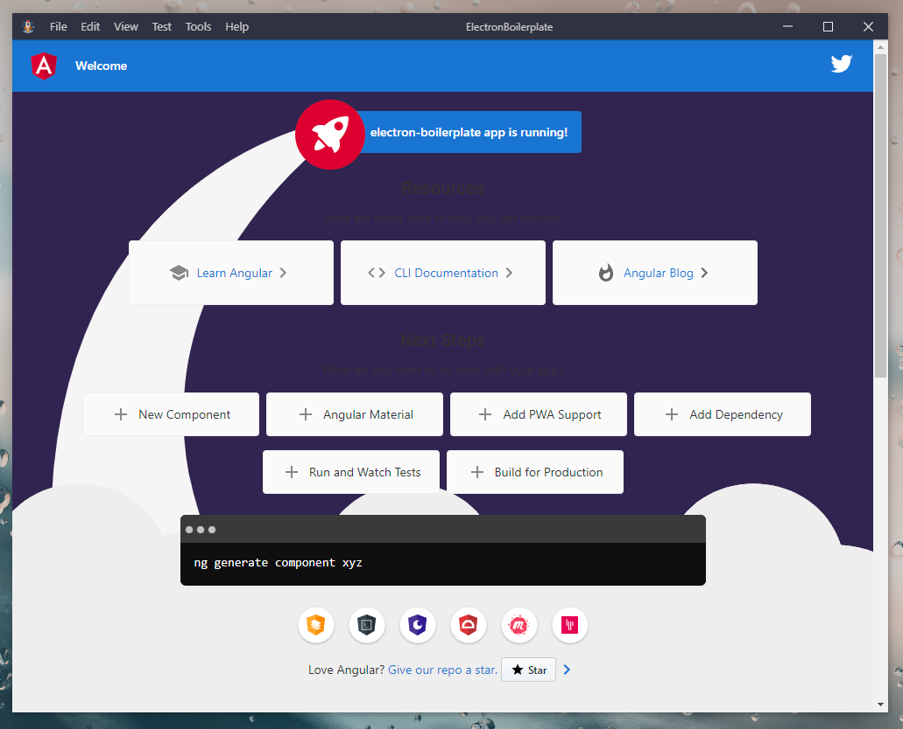

<p align="center">
  
  
  
  
</p>

<h3 align="center">Electron Angular Material project boilerplate</h3>

<p align="center">Create new project with Electron + Angular + Angular Material or simple Angular project</p>

## About

`tfSheol/angular-electron-boilerplate` is a GitHub template repository for creating a new Electron app with Angular & Angular Material, maintained by @tfSheol.

```json
// Versions

# Angular    11.2.1
# Material   11.2.1
# Electron   11.2.3
# RxDB       9.14.0
# Node       12.18.3
# Chromium   87.0.4280.141
```



---

## Repo template

Setup as a starter template, you can easily generate a new GitHub repository. From the repository homepage, click the `Use this template` button.

## What's included

**>> todo <<**

- [Electron](https://www.electronjs.org/)
- [Angular](https://angular.io/)
- [Angular material](https://material.angular.io/)
- [RxDB](https://rxdb.info/)
- [pouchdb-adapter-idb](https://www.npmjs.com/package/pouchdb-adapter-idb)
- [angular-web-worker](https://www.npmjs.com/package/angular-web-worker)
- [custom-electron-titlebar](https://www.npmjs.com/package/custom-electron-titlebar)

## Usage

Be sure to have [Node.js](https://nodejs.org/) installed before proceeding.

```bash
# Clone the repo
git clone https://github.com/tfSheol/angular-electron-boilerplate.git
cd angular-electron-boilerplate

# Install dependencies
npm install

# Start a local server (uses serve)
npm run start

npm run build
npm run build:prod

npm run start:electron

npm run build:dev:electron
npm run build:prod:electron

npm run make:linux
npm run make:mac
npm run make:win32

```

For the developpement you can use `npm run start` and open <http://localhost:3000> to see the page in action.

## Scripts

**>> todo <<**

## Generate electron app with latest Angular version (from scratch or use this repo)

**>> todo <<**

First update your angular cli to latest version ! Or juste intall it.

```bash
$ npm install @angular/cli -g
```

```bash
$ ng new electron-boilerplate
$ cd electron-boilerplate
$ npm install electron@latest --save-dev
```

```json
// package.json

{
  "name": "electron-boilerplate",
  ...
  "main": "app.js",
  "scripts": {
    ...
    "start:electron": "ng build --base-href ./ && electron ."
  }
  ...
}
```

```typescript
// app.js

const { app, BrowserWindow } = require('electron')

function initWindow() {
    let appWindow = new BrowserWindow({
        width: 1000,
        height: 800,
        webPreferences: {
            nodeIntegration: true
        }
    });

    appWindow.loadURL(`file://${__dirname}/dist/index.html`);

    appWindow.webContents.openDevTools();

    appWindow.on('closed', function () {
        appWindow = null;
    });
}

app.on('ready', initWindow);

app.on('window-all-closed', function () {
    if (process.platform !== 'darwin') {
        app.quit();
    }
});

app.on('activate', function () {
    if (win === null) {
        initWindow();
    }
});
```

Check install with `$ npm run start:electron`

```bash
$ npx @electron-forge/cli@latest import
```

```json
// package.json
}
  ...
  "scripts": {
    "ng": "ng",
    "start": "ng serve",
    "build": "ng build",
    "build:prod": "ng build --prod",
    "build:prod:electron": "ng build --base-href ./ --prod",
    "build:dev:electron": "ng build --base-href ./ --source-map=false",
    "test": "ng test",
    "lint": "ng lint",
    "e2e": "ng e2e",
    "start:electron": "ng build --base-href ./ && electron .",
    "package": "electron-forge package --arch=x64 --platform=darwin,linux,win32",
    "make": "electron-forge make",
    "make:mac": "electron-forge make --arch=x64 --plateform darwin",
    "make:linux": "electron-forge make --arch=x64 --plateform linux",
    "make:win32": "electron-forge make --arch=x64 --platform=win32"
  },
  ...
  "config": {
    "forge": {
      "packagerConfig": {
        "asar": true,
        "ignore": [
          "^/(?!(dist|app.js|package.json)).*$"
        ]
      },
      ...
    }
  }
  ...
}
```

## Web worker

**>> todo <<**

```bash
$ cd src/app/worker
$ ng g angular-web-worker:angular-web-worker
```

```typescript
// app.module.ts

import { WorkerModule } from 'angular-web-worker/angular';
import { AppWorker } from './app.worker';

@NgModule({
  ...
  imports: [
    ...,
    WorkerModule.forWorkers([
       {worker: AppWorker, initFn: () => new Worker('./app.worker.ts', {type: 'module'})},
    ]),
    ...
  ],
})
export class AppModule { }
```

## RxDB

**>> todo <<**

```json
// angular.json

...
"architect": {
  "build": {
    "builder": "@angular-devkit/build-angular:browser",
    "options": {
      "allowedCommonJsDependencies": [
        "deep-equal", "object-path", "@babel/runtime/helpers/wrapNativeSuper",
        "@babel/runtime/helpers/inheritsLoose", "@babel/runtime/regenerator",
        "immediate", "object-path"
      ],
      ...
```

## Other stuff

**>> todo <<**

### Extract content of asar file

```bash
$ npx asar extract app.asar ./out
```

### Development server

Run `ng serve` for a dev server. Navigate to `http://localhost:4200/`. The app will automatically reload if you change any of the source files.

### Code scaffolding

Run `ng generate component component-name` to generate a new component. You can also use `ng generate directive|pipe|service|class|guard|interface|enum|module`.

### Build

Run `ng build` to build the project. The build artifacts will be stored in the `dist/` directory. Use the `--prod` flag for a production build.

### Running unit tests

Run `ng test` to execute the unit tests via [Karma](https://karma-runner.github.io).

### Running end-to-end tests

Run `ng e2e` to execute the end-to-end tests via [Protractor](http://www.protractortest.org/).

### Further help

To get more help on the Angular CLI use `ng help` or go check out the [Angular CLI Overview and Command Reference](https://angular.io/cli) page.
